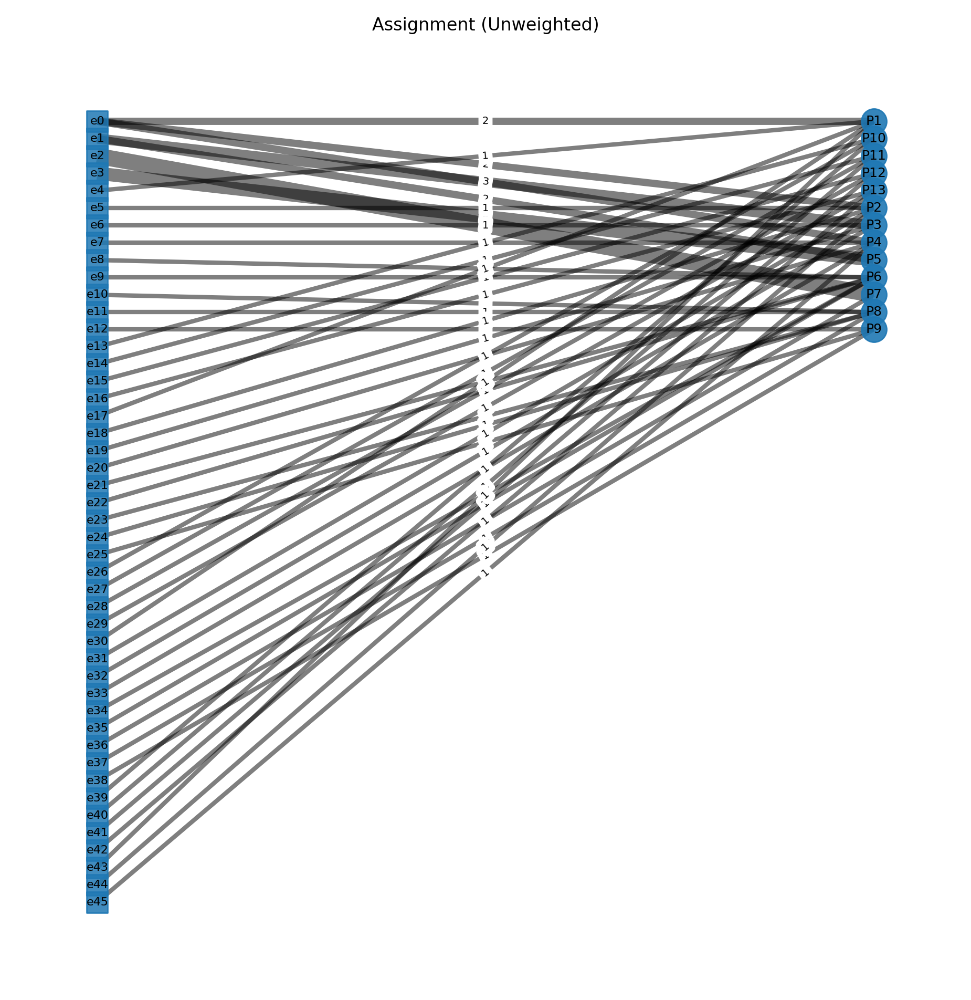

# EN Optimal Assignment Project — *Hungarian Algorithm (Kuhn–Munkres Method)*

**Author: Julien Gimenez**  
**Date: 2025**  
**Language: Python (pandas, networkx)**  


---

## Objective

This project implements a complete system for **optimal assignment** between students and projects based on preferences expressed in the following formats:

- **Ordered**: list of projects by rank (`P1;P2;P3`)
- **Weighted**: list of projects with weights (`P1:0.1;P2:0.3;P3:10`)

The goal is to minimize the **overall satisfaction cost** according to individual or group preferences, using the **Hungarian algorithm** (Kuhn–Munkres Algorithm) combined with a **minimum-cost flow model** to handle multiple capacities.

---

# Inputs:

- Projects to assign: [data/projects.csv](data/projects.csv)
- Unweighted student choices: [data/student-choices_unweighted.csv](data/student-choices_unweighted.csv)
- Weighted student choices: [data/student-choices.csv](data/student-choices.csv)

---

# Results:

- Weighted choices:
    - [data/assignment_student_unweighted.csv](data/assignment_student_unweighted.csv)
    - [data/assignment_project_unweighted.csv](data/assignment_project_unweighted.csv)
- Unweighted choices:
    - [data/assignment_student_weighted.csv](data/assignment_student_weighted.csv)
    - [data/assignment_project_weighted.csv](data/assignment_project_weighted.csv)

- Graph visualizations:
    - Weighted choices: [data/exports/weighted_assignment.png](data/exports/weighted_assignment.png)
    - Unweighted choices: [data/exports/unweighted_assignment.png](data/exports/unweighted_assignment.png)




---

# Operation

## Hungarian Matching Algorithm (Minimum-Cost Flow) – Explanation and 3×3 Example

This program performs an **optimal assignment** of students to projects by minimizing a **global cost**.  
It models the problem as a **minimum-cost flow** on a directed graph.  
In the 1-to-1 case (each project has a capacity of 1), this is equivalent to the classic **Hungarian algorithm**.

---

### 1) General principle

Two input files:

- **projects.csv**: columns `id`, `label` (optional), `capacity` (default 1)  
- **student-choices.csv**: columns `student`, `prefs`, `weight` (default 1), `names` (optional)

#### Preference modes

- **Ordered**: `prefs` such as `A;B;C`  
  Cost by rank: 1st choice = 0, 2nd = 1, 3rd = 2, etc.
- **Weighted**: `prefs` such as `A:0;B:1.5;C:3`  
  The provided numbers are costs (lower = better).  

Any project not listed receives a **penalty** (e.g., 10) to prevent “off-list” assignments.  
If the total capacity is insufficient, a virtual project `__NA__` is added to absorb unassigned students.

---

### 2) Network model

The graph is built with:

- a source node `s`  
- one node per student `e_i`  
- one node per project `p_j`  
- a sink node `t`

#### Arcs

- `s -> e_i`: capacity 1, cost 0  
- `e_i -> p_j`: capacity 1, cost c_ij (depends on preferences)  
- `p_j -> t`: capacity = project capacity, cost 0  

Objective: **minimize** the total cost of used arcs while respecting capacities.  
The solution is obtained using `networkx.min_cost_flow`.

Outputs:
- per **student**: assigned project + initial rank/weight  
- per **project**: number of assigned students + list of names  
- **statistics**: number of assignments, unassigned count, median rank, top-1 and top-3 percentages.

---

### 3) Numerical example: 3 students × 3 projects

- Students: `S1`, `S2`, `S3`  
- Projects: `A`, `B`, `C`  
- Project capacities: `A=1`, `B=1`, `C=1`  
- **Ordered** mode (rank cost: 0, 1, 2)

#### Preferences

| Student | 1st choice | 2nd choice | 3rd choice |
|:--:|:--:|:--:|:--:|
| S1 | A | B | C |
| S2 | B | C | A |
| S3 | B | A | C |

#### Cost matrix c_ij (0=best)

|     | A | B | C |
|:---:|:---:|:---:|:---:|
| S1  | 0 | 1 | 2 |
| S2  | 2 | 0 | 1 |
| S3  | 1 | 0 | 2 |

#### Arc graph

- `s -> S1` (cap=1, cost=0), `s -> S2` (cap=1, cost=0), `s -> S3` (cap=1, cost=0)
- `S1 -> A` (cap=1, cost=0), `S1 -> B` (cap=1, cost=1), `S1 -> C` (cap=1, cost=2)
- `S2 -> A` (cap=1, cost=2), `S2 -> B` (cap=1, cost=0), `S2 -> C` (cap=1, cost=1)
- `S3 -> A` (cap=1, cost=1), `S3 -> B` (cap=1, cost=0), `S3 -> C` (cap=1, cost=2)
- `A -> t` (cap=1, cost=0), `B -> t` (cap=1, cost=0), `C -> t` (cap=1, cost=0)

The total flow to send is 3 (the 3 students).

---

#### Possible assignments and total cost

| Assignment | Total cost |
|:--|:--:|
| (S1→A, S2→B, S3→C) | 0 + 0 + 2 = **2** |
| (S1→A, S2→C, S3→B) | 0 + 1 + 0 = **1** ✅ |
| (S1→B, S2→C, S3→A) | 1 + 1 + 1 = **3** |
| (S1→C, S2→A, S3→B) | 2 + 2 + 0 = **4** |

**Optimal assignment:**
- `S1 -> A` (rank 1, cost 0)
- `S2 -> C` (rank 2, cost 1)
- `S3 -> B` (rank 1, cost 0)

**Minimum total cost**: **1**

---

#### Satisfaction indicators

- Assigned students: 3 / 3 = **100 %**  
- Unassigned: **0**  
- Obtained ranks: (1, 2, 1)  
- Median rank: **1**  
- Top-1 rate: 2 / 3 ≈ **66.7 %**  
- Top-3 rate: **100 %**

---

### 4) Weighted variant

Assume explicit costs (lower = better):

| Student | A | B | C |
|:--:|:--:|:--:|:--:|
| S1 | 0 | 1 | 3 |
| S2 | 3 | 0 | 1 |
| S3 | 2 | 0 | 3 |

These costs are used on arcs `e_i -> p_j` (penalty 10 if a project is not rated).  
The solution remains the same since the preference order is identical:

- `S1 -> A`  
- `S2 -> C`  
- `S3 -> B`  
- Minimum total cost = **1**

---

### 5) Practical notes

- The **penalty** (e.g., 10) prevents off-list assignments as long as a preferred option is available.  
- The virtual project `__NA__` appears only if the **total capacity** is less than the **number of students**.  
- The program exports results in CSV, GraphML, GEXF, JSON, and can generate a **bipartite visualization** 
  (students on the left, projects on the right, edge thickness proportional to the flow).

---

*This Markdown version is compatible with GitLab and Jupyter, without LaTeX.*

---

## Weight scale

| Intention | Suggested weight | Interpretation |
|------------|----------------:|----------------|
| ❤️ First choice | **0.1** | Very strong desire |
| 💚 Excellent choice | **0.15 – 0.25** | Strong preference |
| 💛 Good choice | **0.25 – 0.35** | Positive preference |
| 😐 Neutral | **0.5** | Indifferent |
| 😒 To avoid | **1 – 3** | Weak preference |
| 😖 Disliked | **6 – 9** | Very weak preference |
| 💀 Hated | **10** | Strong penalty |

---

## Execution

### Notebook mode
```bash
jupyter notebook src/Assignment-Project_Hungarian-Method.ipynb
```

[Assignment-Project_Hungarian-Method.ipynb](src/Assignment-Project_Hungarian-Method.ipynb)

---

## Installation

```bash
pip install -r requirements.txt
```

---

## 🧾 License

Open-source license BSD 3-Clause 
© 2025 — Julien Gimenez  

> *“The elegance of an optimal assignment is measured by total satisfaction.”*
