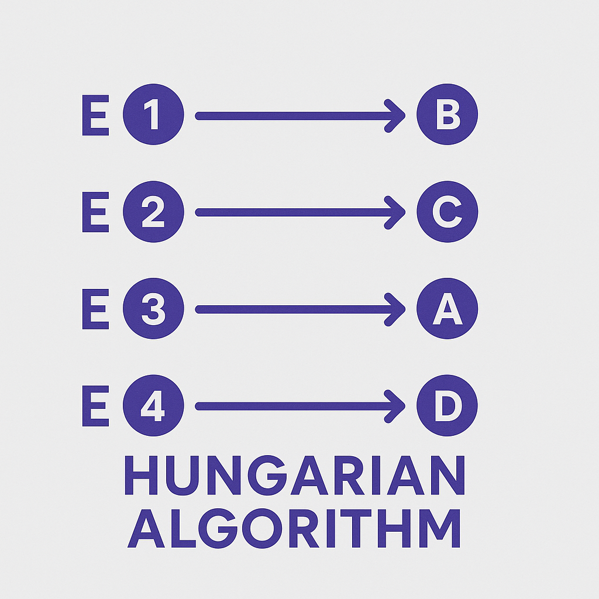
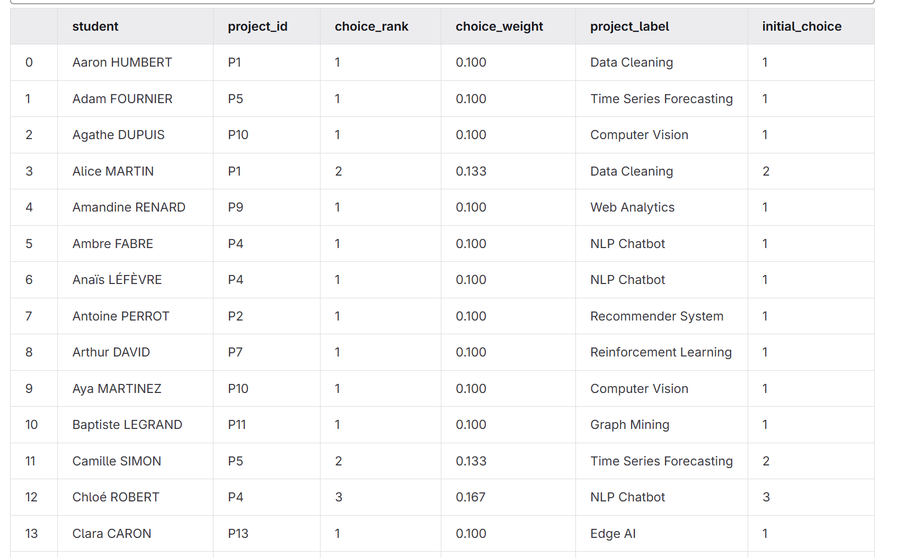
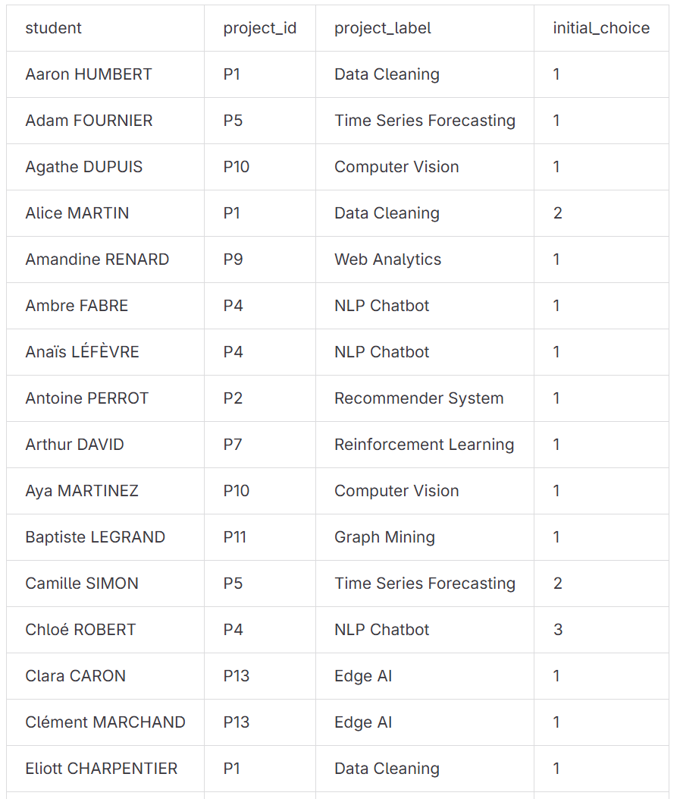
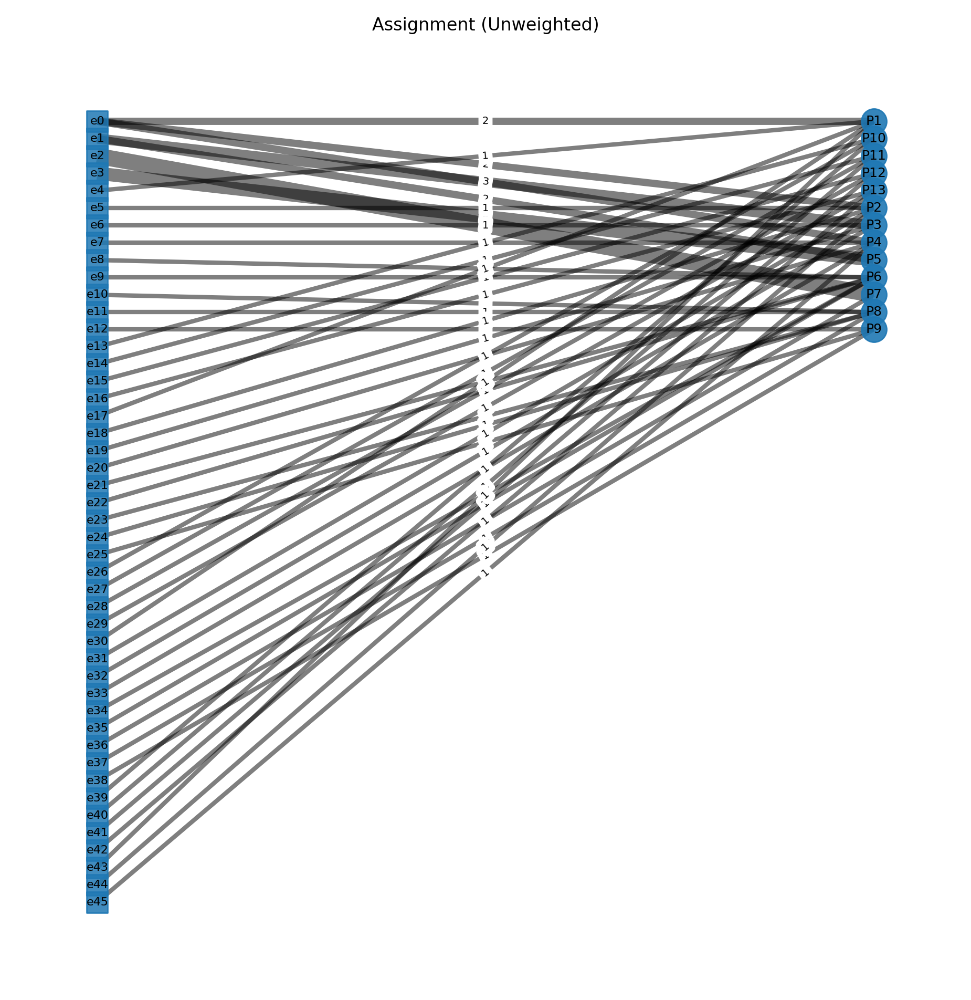

# FR Projet d’affectation optimale — *Méthode Hongroise (Hungarian Algorithm)*

**Auteur : Julien Gimenez**  
**Date : 2025**  
**Langage : Python (pandas, networkx)**  



---

## Objectif

Ce projet implémente un système complet d'**affectation optimale** entre étudiants et projets à partir de préférences exprimées sous forme :

- **Ordonnée** : liste de projets par rang (`P1;P2;P3`)
- **Pondérée** : liste de projets avec poids (`P1:0.1;P2:0.3;P3:10`)

L'objectif est de minimiser le **coût global de satisfaction** selon les choix individuels ou de groupe, en utilisant l'algorithme hongrois (Hungarian / Kuhn-Munkres Algorithm) combiné à un modèle de **flot à coût minimum** pour gérer les capacités multiples.

---
# Résultats:






---
# Fonctionnement

## Algorithme de couplage hongrois (flot à coût minimal) – Explication et exemple 3×3

Ce programme réalise une **affectation optimale** d’étudiants vers des projets en minimisant un **coût global**.  
Il modélise le problème comme un **flot à coût minimal** sur un graphe orienté.  
Dans le cas 1–à–1 (chaque projet a une capacité de 1), on retrouve l’algorithme dit “hongrois”.

---

### 1) Principe général

Deux fichiers d’entrée :

- **projects.csv** : colonnes `id`, `label` (optionnel), `capacity` (défaut 1).  
- **student-choices.csv** : colonnes `student`, `prefs`, `weight` (défaut 1), `names` (optionnel).

#### Modes de préférences

- **Ordonné** : `prefs` comme `A;B;C`.  
  Coût par rang : 1er vœu = 0, 2e vœu = 1, 3e vœu = 2, etc.
- **Pondéré** : `prefs` comme `A:0;B:1.5;C:3`.  
  Les nombres fournis sont les coûts (plus petit = mieux).  

Tout projet non cité reçoit une **pénalité** (ex. 10) pour éviter les affectations “hors-liste”.  
Si la capacité totale est insuffisante, un projet virtuel `__NA__` est ajouté pour absorber les non-affectés.

---

### 2) Modélisation réseau

On construit un graphe avec :

- un nœud source `s`,  
- un nœud étudiant par entrée `e_i`,  
- un nœud projet par projet `p_j`,  
- un nœud puits `t`.

#### Arcs

- `s -> e_i` : capacité 1, coût 0  
- `e_i -> p_j` : capacité 1, coût c_ij (dépend des préférences)  
- `p_j -> t` : capacité = capacité du projet, coût 0  

Objectif : **minimiser** la somme des coûts des arcs utilisés, tout en respectant les capacités.  
La résolution utilise `networkx.min_cost_flow`.

Sorties :
- par **étudiant** : projet attribué + rang/poids initial ;
- par **projet** : effectif et liste des étudiants ;
- **statistiques** : nombre affectés, non-affectés, médiane de rang, taux de 1er vœu, taux top-3.

---

### 3) Application numérique détaillée : 3 étudiants × 3 projets

- Étudiants : `S1`, `S2`, `S3`  
- Projets : `A`, `B`, `C`  
- Capacités des projets : `A=1`, `B=1`, `C=1`  
- Mode **ordonné** (coût par rang : 0, 1, 2)

#### Préférences

| Étudiant | 1er vœu | 2e vœu | 3e vœu |
|:--:|:--:|:--:|:--:|
| S1 | A | B | C |
| S2 | B | C | A |
| S3 | B | A | C |

#### Matrice des coûts c_ij (0=meilleur)

|     | A | B | C |
|:---:|:---:|:---:|:---:|
| S1  | 0 | 1 | 2 |
| S2  | 2 | 0 | 1 |
| S3  | 1 | 0 | 2 |

#### Graphe d’arcs

- `s -> S1` (cap=1, cost=0), `s -> S2` (cap=1, cost=0), `s -> S3` (cap=1, cost=0)
- `S1 -> A` (cap=1, cost=0), `S1 -> B` (cap=1, cost=1), `S1 -> C` (cap=1, cost=2)
- `S2 -> A` (cap=1, cost=2), `S2 -> B` (cap=1, cost=0), `S2 -> C` (cap=1, cost=1)
- `S3 -> A` (cap=1, cost=1), `S3 -> B` (cap=1, cost=0), `S3 -> C` (cap=1, cost=2)
- `A -> t` (cap=1, cost=0), `B -> t` (cap=1, cost=0), `C -> t` (cap=1, cost=0)

Le flot total à envoyer vaut 3 (les 3 étudiants).

---

#### Affectations possibles et coût total

| Affectation | Coût total |
|:--|:--:|
| (S1→A, S2→B, S3→C) | 0 + 0 + 2 = **2** |
| (S1→A, S2→C, S3→B) | 0 + 1 + 0 = **1** ✅ |
| (S1→B, S2→C, S3→A) | 1 + 1 + 1 = **3** |
| (S1→C, S2→A, S3→B) | 2 + 2 + 0 = **4** |

**Affectation optimale :**
- `S1 -> A` (rang 1, coût 0)
- `S2 -> C` (rang 2, coût 1)
- `S3 -> B` (rang 1, coût 0)

**Coût total minimal** : **1**

---

#### Indicateurs de satisfaction

- Étudiants affectés : 3 / 3 = **100 %**  
- Non-affectés : **0**  
- Rangs obtenus : (1, 2, 1)  
- Médiane du rang : **1**  
- Taux de 1er vœu : 2 / 3 ≈ **66,7 %**  
- Taux top-3 : **100 %**

---

### 4) Variante pondérée

Supposons des coûts explicites (plus petit = mieux) :

| Étudiant | A | B | C |
|:--:|:--:|:--:|:--:|
| S1 | 0 | 1 | 3 |
| S2 | 3 | 0 | 1 |
| S3 | 2 | 0 | 3 |

On utilise ces coûts sur les arcs `e_i -> p_j` (pénalité 10 si un projet n’est pas noté).  
La solution reste la même, car l’ordre des préférences est identique :

- `S1 -> A`  
- `S2 -> C`  
- `S3 -> B`  
- Coût total minimal = **1**

---

### 5) Notes pratiques

- La **pénalité** (ex. 10) empêche les affectations hors-liste tant qu’une option listée reste disponible.  
- Le projet virtuel `__NA__` n’apparaît que si la **capacité totale** est inférieure au **nombre d’étudiants**.  
- Le programme exporte les résultats en CSV, GraphML, GEXF, JSON, et peut aussi générer une **visualisation bipartite** 
  (étudiants à gauche, projets à droite, épaisseur des arcs proportionnelle au flux).

---

*Cette version Markdown est compatible avec GitLab et Jupyter, sans LaTeX.*


---
## Échelle des pondérations

| Intention | Poids conseillé | Interprétation |
|------------|----------------:|----------------|
| ❤️ Premier choix | **0.1** | Très fort désir |
| 💚 Très bon choix | **0.15 – 0.25** | Fort désir |
| 💛 Bon choix | **0.25 – 0.35** | Préférence positive |
| 😐 Neutre | **0.5** | Indifférent |
| 😒 À éviter | **1 – 3** | Préférence négative |
| 😖 Peu apprécié | **6 – 9** | Très peu souhaité |
| 💀 Détesté | **10** | Forte pénalité |

---

## Exécution


### Mode notebook
```bash
jupyter notebook src/Assignment-Project_Hungarian-Method.ipynb
```

[Assignment-Project_Hungarian-Method.ipynb](src/Assignment-Project_Hungarian-Method.ipynb)


---

## Installation

```bash
pip install -r requirements.txt
```

---

## 🧾 Licence

Licence libre **BSD 3-Clause**  
© 2025 — Julien Gimenez  

> ✨ *“L'élégance d'une affectation optimale se mesure à la satisfaction totale.”*
